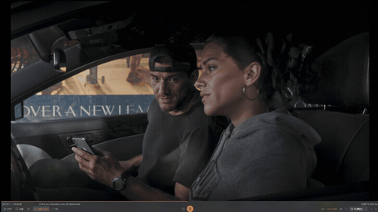

# Veyra

[English](README_EN.md) | 简体中文

<p align="center">
  <a href="https://github.com/Likely7/Veyra-NRVideo/blob/main/REAMDE%20MP4.mp4">
    
  </a>
</p>

<p align="center">演示视频会自动播放；点击画面可打开原始 MP4。</p>

Windows 视频播放器与采集卡增强工具。支持视频、图片和采集卡实时预览，可组合使用超分辨率、NR 画面增强与补帧。

[下载 0.0.4 免安装版](https://github.com/Likely7/Veyra-NRVideo/releases/tag/v0.0.4) · [更新记录](docs/RELEASE_NOTES_0.0.4.md) · [反馈问题](https://github.com/Likely7/Veyra-NRVideo/issues)

## 功能

| 功能 | 支持内容 |
| --- | --- |
| 播放与采集 | H.264 / HEVC 视频、PNG / JPEG 图片、DirectShow / UVC 采集卡 |
| 超分辨率 | DLSS SR、RTX Video SR；2K / 4K / 8K 目标，保持画面比例 |
| NR 增强 | 实验性 NVIDIA NR；实时档与原生档，风格、强度和局部保护调整 |
| 帧生成 | DLSS 2X / 3X / 4X，实验性 XeSS 2X 预览补帧 |
| 调整与对比 | 设置实时生效、还原默认、原画对比、分屏、画面缩放 |
| 导出 | PNG / JPEG 图片，NVENC H.264 / HEVC 视频 |
| 实时状态 | 源帧处理、有效补帧、呈现提交、链路耗时和软件延迟 |

日常模式以观看为主；专业模式展开增强参数、诊断和导出工具。切换模式不需要重新打开视频。

0.0.4 修复增强处理造成的音画不同步，以及 NR 耗时轻微波动时的音频卡顿；同时修正 XeSS 补帧下的音频播放时序。

## 下载与运行

1. 在 [Releases](https://github.com/Likely7/Veyra-NRVideo/releases) 下载 **Veyra-0.0.4-win64-portable.zip**，不要下载 Source code。
2. 完整解压到一个可写文件夹，双击 **Veyra.exe**。无需安装 SDK、Python 或开发工具。
3. 使用当前显卡驱动。要使用 NVIDIA NR、DLSS、RTX Video SR 和 NVENC，需兼容的 NVIDIA RTX 显卡；本版本主要在 RTX 5070 上验证。

系统要求：Windows 11 x64、DirectX 12。便携包含当前功能所需运行组件，显卡驱动和采集卡驱动由系统提供。8K 超分和原生高分辨率增强需要更多显存，不保证每个组合都能实时运行。

升级时先退出旧版，解压到新目录。需要保留设置时，复制旧目录下的 `runtime_local/*.v1` 与 `veyra.ini`；不要用旧目录整体覆盖新版运行组件。

## 使用教程
如果这个项目对你有所帮助，欢迎请作者喝杯咖啡！你的支持是持续维护的最大动力


### 视频与图片

点击底栏“打开”选择文件。底栏提供播放、进度、音量、字幕和全屏；切换到专业模式后，鼠标位于画面上时可用滚轮缩放。

### 采集卡

1. 连接设备，关闭其他软件对同一采集卡的占用。
2. 点击“采集”，选择设备、分辨率、帧率、像素格式及音频设备。
3. 先关闭增强确认基础画面，再按需打开 NR、超分和补帧。同一模式下可优先试 YUY2 / NV12。
4. 若主机游戏为30fps、采集卡输出60fps，在专业模式的内容节奏中选择60转30；真正60fps内容使用原始采集节奏。

### 增强与补帧

专业模式中分别开启 NR、超分和补帧。超分下方选择算法及目标尺寸；补帧页选择 DLSS 或 XeSS 及可用倍率。建议从实时 NR、较低 RTX Video SR 档位和2X补帧开始，结合对比画面与实时状态调整。

处理跟不上时降低画质、倍率或目标尺寸。软件延迟指采集回调到 Present 返回，不包含完整采集卡和屏幕扫描延迟；补帧不能降低游戏输入延迟。

音画同步自动跟随软件处理链路，采集卡音视频共同的输入延迟不会重复补偿。轻微耗时波动不会逐帧停放声音；如果 GPU 持续处理不过来，仍可能等待视频，需要降低增强负载。

### 导出与运行组件

在专业模式选择图片保存或视频导出、格式与输出位置。XeSS 目前仅用于预览；视频导出使用已支持的 DLSS 路径。

允许自行替换 DLL：退出软件后，NVIDIA 文件放在 `runtime/experimental/`，XeSS / XeLL 放在 `runtime_local/intel/experimental/`，保留文件名。软件不锁定哈希或签名；清单仅记录发布包原件，替换版的接口与硬件兼容性不作保证。卸载整个软件只需退出后删除解压目录。

### NR 运行版本

专业模式 → 增强 → NR 运行版本，可选 NVIDIA 原版或 RTX 40/50 社区兼容版。切换会短暂停顿，失败恢复上一套设置。社区版已随包放在 `runtime/experimental/nr-community/`，无需手动覆盖原版。它是社区修改文件，签名状态为 `HashMismatch`，不是有效 NVIDIA 签名原件；两版目前均在 RTX 5070 验证。

### OBS 直播与录制

添加“窗口采集”，选择 Veyra，并将“捕获方式”手动设为 **Windows 10（1903及以上）**。不要依赖“自动”：它可能选中 BitBlt，导致只捕获 UI、视频区域没有画面。本机已通过切换到该 Windows 捕获方式恢复视频。

软件里的“直播兼容 · 实验”只切换显示交换链，不能解决 BitBlt 捕获问题，默认关闭即可。其他录屏软件优先选 Windows Graphics Capture / WGC；未验证所有录屏软件及补帧输出的捕获节奏。

## 技术路线与边界

```text
视频 / 图片 / 采集卡 → 颜色处理 → SR → NR → 帧生成 → 显示 / 导出
```

C++20、Win32、D3D12；文件由 FFmpeg 处理，采集使用 DirectShow，视频导出使用 NVENC。各入口共享增强管线，采集保留最新帧，光流提供估算的运动信息。

NR 与 DLSS 帧生成属于 **community experimental / 社区实验集成**，不是 NVIDIA 官方认证或完整游戏原生集成。采集画面没有游戏引擎的原生深度和运动数据，效果可能存在拖影或细节变化。AMD NR 暂未提供；FRUC 已移除；HDR、AV1 / ProRes 导出尚不支持。实卡兼容性与长期稳定性仍需持续验证。

## 开发与许可

[构建说明](docs/BUILD.md) · [组件清单](docs/RUNTIME_COMPONENTS_0.0.4.md) · [第三方许可](THIRD_PARTY_NOTICES.md)

源码采用 [GPLv3](LICENSE)。SDK、模型和运行时不进入源码仓库；Release 组件按各自许可与实验发布范围单独提供。
