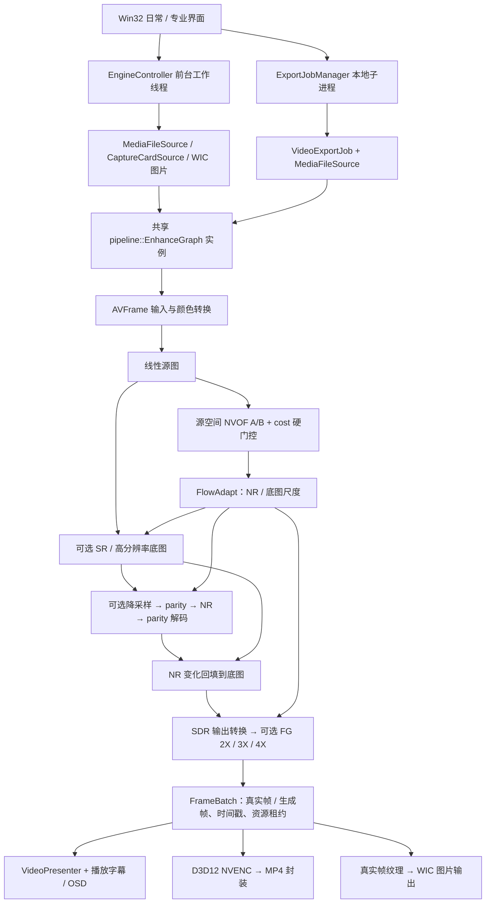

# 原始方案与当前架构对照审计

日期：2026-09-08。审计基线：本地 `f79ef95deb2dc0375e7a2adb936e7d4d4298f93a`。

> 后续决定与调研更新：用户要求导出完整性检查保持现状，不增加正常使用负担；下文第 6 节扩大每次导出检查的建议不再执行。深度、C 帧与新后端按实测收益重新排序，具体见 [画质、4K 超分与帧生成优化方案](QUALITY_OPTIMIZATION_PLAN_2026-09-08.md)。本审计保留原始差距记录，不把尚未实现的内容改写成已经完成。

## 1. 结论与证据边界

当前已经有真实的三入口和共享 GPU 增强主干：播放、采集、图片处理和视频导出复用 `pipeline::EnhanceGraph`，其中包含实际的 NVOF、SR、NR、parity、残差合成和 FG 调用。视频导出使用真实 D3D12 NVENC。不能把当前工程说成只有 UI 或接口壳。

但它还不是原方案完整落地的架构。主要差距在于：完整帧数据契约没有贯通；Guidance 仍内嵌在增强图中，质量验证只实现了基础 cost 门控；没有真实深度推理、C 帧验证或离线双向质量分支；产品播放与导出主动关闭硬解；字幕、导出格式和完整性验证仍比原定范围窄。

本次是源码与方案对照，不是新一轮运行验收。未修改应用源码，未构建，未执行 RTX / NGX Create/Evaluate、实卡或性能测试。下文“存在实现”不等于当前全部组合已经运行通过；静态推导的问题也不冒充已测得的视觉或延迟结果。整体状态保持 `Phase 7 / needs_review`。

## 2. 对照依据与已经批准的调整

原始基线：

- [产品规范](../VEYRA_PRODUCT_SPEC_V1.md)：三模式产品范围、帧与 Guidance 契约、完整质量链。
- [施工手册](../VEYRA_AGENT_EXECUTION_PLAYBOOK_V1.md)：共享引擎、颜色解析、质量验证、深度、硬解、NVENC、字幕和门禁的具体要求。
- [项目规则](../AGENTS.md)、[竞品审计](COMPETITOR_AUDIT_2026-09-03.md)、[README](../README.md) 与 [工作记录](WORKLOG.md)：边界与当前状态。

以下是后续明确接受的变化，不能当成擅自偏离：

| 调整 | 当前应采用的解释 | 依据 |
|---|---|---|
| 默认实时 NR 允许约 1080p 内部处理 | 保留高分辨率底图，NR 变化回填；原生 NR 可选，视频导出保持原生处理要求。不能把实时档称为 native 4K NR | AGENTS 顶部修订；[修复方案 §3.2–3.5](REPAIR_EXECUTION_PLAN_2026-09-07.md) |
| 光流提前到源空间 | 原方案 post-SR 光流已改为 source-space NVOF，再分别适配 NR / SR / FG 的分辨率与向量尺度 | 修复方案 §3.3–3.4 |
| 深度可暂缺 | 接管计划允许 Motion Only；修复方案明确“新接深度模型不属于本次任务”。它仍是原完整方案未实现项，不能说这轮修复删掉了已经存在的模型 | [接管计划 F2](ACTIVE_DELIVERY_PLAN.md)、修复方案第 139 行 |
| 日常 / 专业 UI、后台导出进程 | 取代原三标签页；模式切换复用前台会话，独立本地进程调用共享导出库 | [双模式方案 §5–7](UI_DUAL_MODE_EXECUTION_PLAN_2026-09-08.md)，第 295 行 |
| 原生 DirectShow 与采集音频链 | avdevice 缺失时允许原生 DirectShow；后续 UI 方案接受控制现有 DirectShow 音频 graph 的音量 | 接管计划 F5；双模式方案第 284 行 |
| FG 3X / 4X | 是后续扩大范围，不能以原 V1 只承诺 2X 为由撤掉 | 修复方案 §3.4、帧批次与输出合同 |
| 短测与实卡验收 | 每次测试最多 300 秒，累计不限于 300 秒；当前实卡体验由用户验收。旧 30 分钟 / 默认原生 4K60 门槛不应重新强加 | AGENTS、接管计划、用户后续澄清 |
| 失败 / 取消保留 partial | 后续 UI 方案允许保留以诊断；这与原先清理策略不同，但不是未授权更改。保留文件不等于有崩溃恢复功能 | 双模式方案 §7 |

## 3. 原方案与当前实际调用链

原方案的核心结构是：

```text
FrameSource
  → 完整 FramePacket（有理 PTS、时长、颜色、epoch、GPU 所有权）
  → 统一线性工作纹理
  → 可选 SR
  → FrameWindow + GuidanceProvider
      NVOF + 多信号 confidence + 可选深度与时间稳定
      A/B 实时；可选 C 验证；导出双向 / 未来帧验证
  → parity encode → NR → parity decode → FG
  → 字幕 / OSD → FrameSink
```

当前产品的实际结构如下。光流提前、NR 分辨率拆分与残差回填是后续批准的设计：



这里的“共享”是复用同一个产品类及其算法实现，不是前台与导出跨进程共用一个 GPU 对象。导出进程拥有自己的设备、图和资源，符合后续方案。

关键入口：[EngineController.cpp](../src/engine/EngineController.cpp) 第 66、83–86、155 行；[VideoExportJob.cpp](../src/engine/VideoExportJob.cpp) 第 23、30、82 行；[ExportJobManager.cpp](../src/engine/ExportJobManager.cpp)；[实际增强图](../src/pipeline/EnhanceGraph.cpp) 第 589–1020 行。

## 4. 逐项对照

| 项目 | 原方案要求 | 当前实现与判定 |
|---|---|---|
| 平台与推理后端 | C++20 / Win32 / D3D12 / 直接 NGX；不依赖 ReShade | 产品主线符合。已有实际 Create/Evaluate 调用，不是只计数 |
| 三入口共享主干 | Source → Graph → Sink；核心算法不留在 probe | 已有真实共享图、前台控制器和导出库。输入 / 输出接口的统一程度仍不足 |
| 帧契约 | PTS、duration、color、source epoch、GPU 所有权贯通 | 类型已定义，但 graph 实际接收 AVFrame、double 毫秒、reset bool 和序号；颜色与来源 epoch 没随完整 packet 进入图 |
| Reset | 所有历史模块消费统一原因与 epoch | 图内部有实际 epoch / reset，seek、暂停恢复、drop 等已有处理；独立 ResetCoordinator 没有接入产品调用链，完整原因与源 epoch 契约未贯通 |
| 光流与 confidence | cost + 亮度残差 + 边界 / 遮挡；质量模式加双向验证；平滑降权 | 有真实 NVOF current→previous 和 /32 转换；只按 cost 硬阈值清零，不是完整质量链 |
| 深度 | 可选 DAV2 Small 推理、归一化、重投影、age / Auto 回退 | 没有模型推理 provider；NR 深度常量 0.5，FG 常量 0.9。后续修复范围明确暂不接模型 |
| A/B/C 与导出质量 | A/B 补帧；C 做质量验证；导出利用未来帧和双向信息 | A/B 补帧与帧批次已有；C 验证、离线双向质量分支缺失。导出预扫时间戳不是未来画面质量分析 |
| 硬解与场景分析 | D3D12VA 优先；GPU histogram / SAD / confidence 辅助切镜 | D3D12VA 后端存在，产品播放与导出设为 false。场景检测仅在软件输入分支采样，硬件输入分支没有对应的内容分析 |
| 实时 NR / SR / FG | 原始同 working extent，后续改为分辨率拆分与残差回填 | 后续结构已实现；SR、NR、FG 有真实路径。不能由此直接推断所有组合满足实时性能 |
| 采集 | 容量 1 mailbox、drop reset、有界 A/B(/C)、可靠时间与颜色 | 真实 DirectShow 和 mailbox 已有；packet 未填写 duration / colorInfo，存在调度数据问题。音频用后续接受的 DirectShow 链 |
| GPU 资源 | 轮转 slots、有界历史、按类型 / 尺寸的资源池、全图显存预算 | 有固定 command / real / generated / NVENC slots 和资源租约；没有产品级 QueryVideoMemoryInfo 预算与统一资源池准入 |
| 字幕 | 外置 SRT、首条内嵌文本字幕、libass 基础 ASS 样式；FG 后合成 | 播放外置 SRT 与后置覆盖存在；内嵌文本字幕 / ASS / libass 链未完成 |
| 视频导出 | D3D12 NVENC H.264 / HEVC，MP4 / MKV，remux / AAC，字幕策略 | D3D12 NVENC 与 MP4 是真实实现；目前固定 MP4，音频不兼容则拒绝，没有 AAC fallback；完整字幕处理缺失 |
| 导出验收与恢复 | 完整帧数 / 时长 / 音轨 / 首尾 / 非黑验证；失败恢复 | 产品导出完成后只重新打开并读到第一帧；专项测试曾有更广检查，但不等于每次导出都有完整验证。缺少重启后的任务恢复流程 |
| 质量诊断 | flow / depth / confidence 可视化、reset 原因、GPU pass 时间 | GPU 时间与比较显示已有；缺少完整 Guidance 可视化。quality_probe 自报 depth disabled，不能作为深度完成证明 |

## 5. 本次发现的具体问题

### 5.1 颜色的默认解释有两份，且并不一致

[MediaFileSource.cpp](../src/source/MediaFileSource.cpp) 第 71–90 行把缺失的矩阵按 SD→BT.601 / HD→BT.709 补全，把缺失 transfer 按 BT.709 补全，并记录 assumed 标记。

但 [EnhanceGraph.cpp](../src/pipeline/EnhanceGraph.cpp) 第 694、742–744 行直接重新读取 AVFrame：未显式标为 BT.601 的矩阵走 BT.709；未显式标为 BT.709 / SMPTE170M 的 transfer 走 sRGB。调用处没有把 packet.colorInfo 传入图。

因此，对缺少标签的素材，源层记录的解释和实际 shader 使用的解释可以不同。这是已定位的静态逻辑差异；本次未用测试片量化色差。优先修复方式是让解析后的 ColorDescription 成为后续所有转换的唯一依据。

此外，当前软件入口会先把 RGB 图片 / 采集帧转成 NV12，再进入线性纹理；这使 RGB 输入经历额外的 4:2:0 色度采样。原计划的直接 RGB→linear 入口仍应补齐；具体画质损失需要有针对性的图案验证。

### 5.2 采集时长缺失，FG 调度使用错误的默认值

[CaptureCardSource.cpp](../src/source/CaptureCardSource.cpp) 第 134 行 `packet={}` 后只填 PTS、来源、序号、flags 和 epoch，没有填 duration。

[FramePacket.h](../include/veyra/pipeline/FramePacket.h) 第 17–19 行的 Rational 默认值是 `0/1, known=true`。它不是 unknown。

[EngineController.cpp](../src/engine/EngineController.cpp) 第 168–170 行把这个零时长 clamp 到 `83333` 个 100ns 单位，即约 **8.33ms**，并用于采集开启 FG 时的时间线 lookahead 参数。50fps / 60fps 的真实帧周期应分别约为 20ms / 16.67ms。

这证明当前配置给调度器的时长不正确，不能据此声称实测端到端延迟等于 8.33ms，也不能据此计算一个确定的可见卡顿量。修复应从实际采集格式 / PTS 明确得到 duration，并正确区分零值与未知值。

### 5.3 现有 confidence 并没有完成原定的质量验证

[NvofDensify.hlsl](../shaders/NvofDensify.hlsl) 第 44–48 行计算 `1-cost/255`；超过阈值直接清零 motion，低于阈值保留原向量。图中使用阈值 32。[FlowAdapt.hlsl](../shaders/FlowAdapt.hlsl) 只做重采样和尺度适配，没有根据连续 confidence 平滑衰减 motion。

目前没有亮度重投影残差、出界 / 遮挡验证、双向一致性或深度残差验证。这不是“已经有 confidence 纹理，所以完整 confidence 链也完成”。原手册第 186–187 行明确要求多信号验证与平滑衰减。

加入深度模型不会自动补齐这些问题；低质量光流和不可靠的深度都需要被正确拒绝。

### 5.4 硬解接口存在，但实际产品没有启用

[EngineController.cpp](../src/engine/EngineController.cpp) 第 85 行和 [VideoExportJob.cpp](../src/engine/VideoExportJob.cpp) 第 30 行都明确设置 `preferHardwareDecode=false`。因此当前这两个入口的解码在 CPU 上，随后上传到 GPU；不能把 GPU 增强 / GPU 编码等同于硬件解码已经接通。

[EnhanceGraph.cpp](../src/pipeline/EnhanceGraph.cpp) 第 688–736 行的场景分析只在软件分支执行，当前使用 CPU 小图与直方图；D3D12 输入分支没有同等内容分析。启用硬解前应先补上或迁移场景分析，否则可能丢掉当前软件路径具备的切镜信号。这是静态覆盖缺口，本次没有触发新的硬件播放故障。

### 5.5 同名旧接口仍可能让测试结果被误读

[CMakeLists.txt](../CMakeLists.txt) 第 180 行把旧 [core/EnhanceGraph.cpp](../src/core/EnhanceGraph.cpp) 编入合同测试；第 310 行才把真实 [pipeline/EnhanceGraph.cpp](../src/pipeline/EnhanceGraph.cpp) 接入产品 pipeline。

旧 core 版本只是复制 packet / 更新计数；真实产品图有实际 GPU / NGX 实现。工程中还存在 core / pipeline 两套 FramePacket、FrameWindow 等概念，IGuidanceProvider 的实现目标当前只有 ZeroGuidanceProvider。

所以既不能拿旧 core 壳宣称产品没有实现，也不能拿这个合同测试通过证明真实产品链已通过。后续应明确隔离旧测试模型，贯通产品接口，并让集成测试覆盖实际入口。

## 6. 应如何收敛架构

不需要推翻现有播放器。应保留已经落地的共享 GPU passes、NGX / NVOF 适配、FrameBatch 资源租约、NVENC 和前端会话，围绕原始质量目标补齐数据与验证链。

建议按依赖关系执行：

1. **先贯通帧契约。** 让 Source、Graph、调度器消费一致的 duration、colorInfo、PTS、source epoch / reset reason；先修采集时长和缺省颜色。RGB 入口避免不必要的 NV12 中转。
2. **补齐 motion 的可信度验证。** cost + luma warp residual + 边界 / 遮挡，形成平滑 trust；将场景分析放到两种解码路径都能使用的位置，再接通并验证 D3D12VA。
3. **接入原定可选深度 provider。** 模型身份、GPU 推理、归一化、时间重投影、age 与 Auto 回退必须一起落地。通过对照验证后再决定哪些内容启用，不能以“模型有输出”当作画质提升。
4. **建立 C / 离线质量分支。** 有界 FrameWindow、双向一致性与未来帧验证；证明收益和延迟代价后决定默认值，保留低延迟 A/B。
5. **补齐产品边界与资源准入。** MKV / AAC / 字幕策略、每次导出的完整验证与任务恢复，以及前台与导出并行时的显存预算。

下一条唯一建议任务：**贯通真实产品的 FramePacket，先修正采集 duration 与颜色元数据的唯一解释。** 本次仅完成审计，没有自动启动这项改造。

## 7. 检查记录与剩余门槛

- 实际执行了 `git status --short`、`git rev-parse HEAD`、`rg --files`、`rg -n` 与 `Get-Content`，核对上述方案、源文件、CMake 目标和产品调用点。开始审计时工作树干净。
- 只新增本报告并在 WORKLOG 记录审计；应用源码、EXE、配置、保护门禁、runtime 和 SDK 未改。
- 本次没有构建 / 自动功能测试，没有新增 Create/Evaluate 返回码或 RTX 实测日志；也没有运行实卡。
- README 记录的统一 delivery 门禁差异仍待解决；历史专项通过不能替代当前完整门禁。当前版本实卡体验仍待用户验收。
- 原始完整产品范围中尚未完成的项目，不能通过只更新文档或增加接口类型宣布完成。当前阶段继续保持 `Phase 7 / needs_review`。
