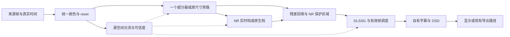

# Veyra 画质、4K 超分与帧生成优化方案

日期：2026-09-08。代码基线：`f79ef95deb2dc0375e7a2adb936e7d4d4298f93a`。这是调研与优化方案，尚未修改产品实现。

## 1. 决策与范围

**值得继续优化，但不能承诺仅靠视频画面达到游戏原生接入的全部效果。优先级是：输入颜色与时序正确 → SR 参数正确 → 可靠运动与 UI 保护 → 对比视频专用超分 → FG 质量调优。深度模型先做收益验证，不作为默认新增负担。**

本次采用用户的最新决定：**导出完整性检查保持现状**。不增加每次导出后的全片解码、逐帧检查、音轨扫描或常驻分析任务。下文测试均为开发阶段的独立短测，不进入正常播放或导出流程。

继续保留已有决定：

- Windows / C++20 / Win32 / D3D12，直接 NGX；三个入口复用现有 `EnhanceGraph`，不更换整套引擎。
- 默认实时档允许约 1080p NR 内部处理与高分辨率残差回填；原生 NR 可选，视频导出维持原生处理要求。界面如实区分“4K 输出”和“原生 4K NR”。
- 保留 DLSS SR、实际 DLSSG 2X / 3X / 4X、采集、播放和导出；新增候选方案先独立比较，不强行替换。
- 每次测试最多 300 秒，累计测试不限于 300 秒；实卡延迟与体验仍由用户验收。

本方案综合了[原始架构审计](ARCHITECTURE_AUDIT_2026-09-08.md)、[接管计划](ACTIVE_DELIVERY_PLAN.md)、[修复方案](REPAIR_EXECUTION_PLAN_2026-09-07.md)、[原施工手册](../VEYRA_AGENT_EXECUTION_PLAYBOOK_V1.md)与当前公开资料。架构审计中“扩大每次导出的完整性验证”的建议由本次决定替代；深度接入也调整为先验证收益。

## 2. 为什么视频后处理与游戏内效果不同

需要分清三种技术：NR 改变画面的材质与光照表现；SR 重建更高分辨率画面；FG 生成中间时刻的画面。NR 输出尺寸是 4K，不能单独证明超分质量；FG 显示帧率提高，也不能单独证明运动正确。

NVIDIA 9 月 1 日研究页面把 DLSS5 的推理条件列为当前渲染画面、引擎运动向量、延续的时序状态和艺术控制值；渲染器场景属性还用于训练监督。因此，**不能把“缺少深度图”直接认定为 NR 效果差的主因，也不能把训练数据与运行时必需输入混为一谈**。[NVIDIA 研究说明](https://research.nvidia.com/labs/adlr/DLSS5/)

对 Veyra 的工程判断如下，属于据上述机制和当前代码作出的推论：

| 差异 | 对效果的影响 | Veyra 能做什么 |
|---|---|---|
| 视频 / HDMI 已经合成完毕 | UI、字幕、抗锯齿、动态模糊、压缩损失可能已写入像素 | 减少后续颜色损失；保护已知 UI 区域；不能假装拥有独立原始图层 |
| 光流来自图像估计 | 遮挡、重复纹理、粒子、镜头切换容易产生错误对应 | 双向一致性、出界与亮度残差检查，坏区域回退 |
| 没有引擎真实 jitter / 深度 / 相机状态 | SR / FG 的部分指导信息只能近似 | 明确接口单位与回退；比较更适合普通视频的算法 |
| 游戏有艺术控制与特定内容适配 | 同一个全局“强度最大”不适合所有素材 | 分开调节结构、明暗和总变化；制作经过对照的内容预设 |
| 当前使用固定实验 Feature 18 | 可调用和有输出不证明与官方游戏模型、配置及接入位置相同 | 固定 DLL 身份，针对当前输出优化，不承诺官方游戏等价 |

游戏内接入的价值可以从 Odyssey 项目看得更具体：它在 TAA 路径取得颜色、游戏运动向量、深度与 jitter，再把 NR 放在后续游戏处理和 UI 之前。这些条件不能从采集卡最终画面原样恢复。[Odyssey DLAA / NR 接入说明](https://github.com/SAOG0721/Assassins-Creed-Odyssey-DLAA/blob/e8e46e43e0bde6c47e60d80aaef78f7ea364b380/README.md)

本次检查的 NVIDIA/DLSS 与 NVIDIA-RTX/Streamline 公开主分支包含 SR / FG 等接口资料，未找到与本机 Feature 18 匹配、可直接替换现有私有参数路径的公开 NR 接口文档。这个结论限定于本次检查的公开树，不代表 NVIDIA 内部接口不存在。[DLSS SDK 快照](https://github.com/NVIDIA/DLSS/tree/a291cc7d2cc642a51566f3dfd5376f635cd1b284)、[Streamline 快照](https://github.com/NVIDIA-RTX/Streamline/tree/e8aaa6eaac968711fb62473d4ae8256dde20919b)

## 3. 类似项目实际采用的方式

以下区分“源码 / 作者实验表明了什么”和“在本机已经验证了什么”。本次没有运行这些项目的二进制，也没有复现它们的整体性能或画质宣传。

| 项目与本次固定版本 | 实际方式与证据 | 对 Veyra 的价值与限制 |
|---|---|---|
| [Magpie Experimental](https://github.com/SAOG0721/Magpie/tree/ac1cc8b0f2efc78323898395cc1336bcbecdc276)，9 月 7 日 | 共享 Guidance；NVOF 前后向估计及 cost / 回投误差置信度；实验 SR、NR 与 FG。当前深度实际来自 ZeroDepth | 优先借鉴运动验证、分辨率适配和调度。**最新源码没有运行 DAV2 深度模型**，不能继续用旧版本描述当前架构 |
| [DLSS5-Reshade-AIO 私有接口实验](https://github.com/kibblerz/DLSS5-Reshade-AIO/blob/5112b4f5ed5ed0865cb56709ece751ce53c039f1/lab/PRIVATE-CONTRACT-FINDINGS.md)，9 月 7 日 | 作者对 310.8 包进行像素实验，发现 `ControlMask` 与 `UIAlpha + Backbuffer` 可分别控制 NR 作用区域与 UI 保护 | 是当前 UI 问题的重要线索；资源格式、极性和效果仍须在 Veyra 固定 hash 上复验，不能只搬参数名 |
| [DLSS5-Feeder](https://github.com/jlrouzies-fr/DLSS5-Feeder/blob/d69d9174ef055f95a657750db814c93ac1ad6c1d/README.md)，9 月 5 日 | ReShade 场景深度与估算运动，D3D12 同设备路径；合成 DLAA / SR 输入。普通 Present 路径的 UI 仍随场景一起处理 | 可研究资源共享。合成 jitter 的 SR 是实验，不是恢复游戏原始采样；README 明确 UI 分离仍有缺口 |
| [video2dlssnr](https://github.com/DaniilSokolyuk/video2dlssnr/tree/55a4ceb588a419b9b56497aa0b563d0c9e2b6c77)，9 月 3 日 | 存在直接 SR / NR、光流相关实现；图片 SR 路径可对同一源图做多次偏移采样与积累 | 可比较 SR 参数和图片实验。重复重采样不产生新的真实视频细节；本次未发现明确许可证，不复用代码 |
| [2600th/dlss5-video-player](https://github.com/2600th/dlss5-video-player/tree/335ddc4523e3614e6dfc507c7d271b8fe0c71ebb)，9 月 3 日 | FFmpeg / D3D12、估算时序指导和深度代理，构造 DLSS 类资源供拦截；架构文档标明 FG 不可用 | 不能作为“已解决高质量 FG”的证据；代理深度也不等于真实几何 |
| [dlss5-infinity-studio](https://github.com/SamG-Coder/dlss5-infinity-studio/blob/4e936b4c3df4a448a86e197396913491354ba312/README.md)，9 月 1 日 | DAV2 / DirectML 深度、Streamline 与离线导出；README 同时列出零运动和切镜 reset 缺口 | **有深度模型不代表完整的时序质量链**；不因此给 Veyra 强接 Streamline 或每帧深度 |
| [dlss5-visual-enhancer](https://github.com/Merserk/dlss5-visual-enhancer/blob/3ad3da9c259636f80b5681088d711de470c895f7/README.md)，9 月 7 日 | Gradio / 原生 worker；README 宣称多种 FG 目标与分段实时处理；实时缓冲配置为 2–30 秒，默认 6 秒 | 可以参考离线工作流；秒级缓冲不适合 Veyra 采集卡低延迟目标。目标 FPS 选项不证明每档都是单次原生 FG |
| [mpv 官方视频滤镜](https://github.com/mpv-player/mpv/blob/master/DOCS/man/vf.rst)，9 月 8 日查阅 | `d3d11vpp` 已有 NVIDIA RTX Super Resolution 扩展入口，受设备与驱动条件影响 | 视频专用 SR 已有实际播放器接入路线；Veyra 优先研究 SDK 的 D3D12 路径，避免为此重写成 D3D11 播放器 |
| [Video2X](https://github.com/k4yt3x/video2x/tree/7db9c18d6278bbad9c3eda0e4e4ae210f9a688eb)、[RIFE 原作者项目](https://github.com/hzwer/ECCV2022-RIFE) | 面向普通视频的超分与插帧路线；Video2X 可选 Real-ESRGAN / Real-CUGAN / RIFE 等 | 适合作为离线质量参照；不能由低分辨率演示推断本机 4K 实时性能，也不把整套模型与 Python 环境塞入默认软件 |

**对旧竞品文档的更正：**[9 月 3 日竞品审计](COMPETITOR_AUDIT_2026-09-03.md)中 Magpie 的 DAV2 路径属于历史版本。本次读取的 `FrameGuidanceService::_Produce` 绑定的是 `zeroDepth.depth`；历史深度 provider 在后续整合提交中被移除。这里只能证明架构改变，不能反推作者已经证明“深度无用”。[当前 Guidance 源码](https://github.com/SAOG0721/Magpie/blob/ac1cc8b0f2efc78323898395cc1336bcbecdc276/src/Magpie.Core/FrameGuidanceService.cpp)、[整合提交](https://github.com/SAOG0721/Magpie/commit/1cde1baedab4d15934720ece4513b6a3fcc7de57)

还查阅了教程与社区问题。教程会建议打开 UI correction，社区也有开启后 UI 仍异常的反馈；两者都不足以证明当前 Veyra 的开关有效。因此下面的结论以本地接线和像素实验为依据。[Igor'sLAB 使用教程](https://www.igorslab.de/en/install-dlss-5-reshade-compatible-games/)、[UI 异常反馈](https://github.com/rakanki911/DLSS5-Swapper/issues/27)

## 4. “剔除 UI”检查结果

### 4.1 接线存在，实际保护资源缺失

当前面板对应项叫“UI修正 · 未证实”。它会经过设置验证、控制器、共享增强图，最终调用 `DLSSNR.UICorrection` 的整数参数设置，**不是单纯没有连接的 UI 按钮**。

但当前 NR 图没有提供 `DLSSNR.UI`、`UIAlpha`、`Backbuffer` 或 `ControlMask` 资源。FG 后端也明确标记其独立的 HUD-less / UI / UIAlpha 资源未提供。NR 的 UI correction 与 FG 的 UI 合成是两条不同接口，打开前者不会自动补齐后者。

源码定位：[面板读取与验证](../apps/veyra/SettingsWindow.cpp)第 32–39 行；[NR 参数提交](../src/pipeline/EnhanceGraph.cpp)第 876–893 行；[FG 资源声明](../src/ngx/DlssFgBackend.cpp)第 163–175 行。

### 4.2 本机像素实测

在 RTX 5070 上直接调用当前产品 `EnhanceGraph`，使用 1280×720 测试画面：静态背景与移动背景各一组，包含固定文字、字幕、数字、彩色 HUD 条。每个配置处理 16 帧，在第 0 / 3 / 7 / 15 帧取样；相同场景每组从 reset 开始。SR / FG 关闭，NR 与 NVOF 开启，以隔离这个参数的作用。

| 对照 | 静态背景 | 移动背景 | 解释 |
|---|---:|---:|---|
| 相同基线重复运行 | RGB 差异为 0 | RGB 差异为 0 | 当前实验可重复 |
| UI 修正 0 → 1，自动遮罩关闭 | RGB 差异为 0 | RGB 差异为 0 | 未观察到 UI 开关效果 |
| UI 修正 0 → 1，自动遮罩开启 | RGB 差异为 0 | RGB 差异为 0 | 自动遮罩没有令该开关在样本上生效 |
| 自动遮罩 0 → 1 | 全图 MAE 0.538；HUD 0.566 | 全图 MAE 0.576；HUD 0.543 | 阳性对照：自动遮罩会改变像素，但不证明能识别并保护 UI |
| 模型强度降到 0 | 全图 MAE 3.180；HUD 5.314 | 全图 MAE 3.482；HUD 5.343 | 阳性对照：NR 输出与参数链确实工作 |

MAE 按 8 位 RGB 通道值计算。最新有效运行 exit 0，用时 **4.600 秒**，包含 **192 次 NR Evaluate、180 次 NVOF Execute**；Feature 18 Create 返回 `0x1 / NVSDK_NGX_Result_Success`，非空句柄，SEH 0。比较发生在 GPU 结果回读后的内存中、PNG 编码之前。

结论：**当前版本不能把这个选项当作有效的“自动剔除 UI”。在上述两类场景、自动遮罩开 / 关组合下，它没有改变取样输出。** 这不是“任何版本、任何内容下该参数永远无效”的证明；本次也没有自动点击原生控件，而是检查控件接线并用设置 API 驱动同一个产品图。

AIO 作者的实验进一步指出：UI 修正需要配套的保护遮罩与原图资源；其 `ControlMask` 是 1 表示应用 NR，而 `UIAlpha` 是 1 表示保护，极性相反。结合本地缺失的资源，这构成下一步最有价值的验证方向，**尚不能写成 Veyra 已完成该资源合同**。[AIO 像素实验记录](https://github.com/kibblerz/DLSS5-Reshade-AIO/blob/5112b4f5ed5ed0865cb56709ece751ce53c039f1/lab/PRIVATE-CONTRACT-FINDINGS.md)

### 4.3 建议怎样做成有效功能

先实现可预测的“保护区域”，再讨论自动识别：

1. 专业模式允许框选少量 UI / 字幕区域并保存为来源预设；保持原有实验参数如实标识，不能继续把它包装成已生效的自动剔除。
2. 在现有 GPU 残差合成中使用保护遮罩：`结果 = 底图 + (1 - 保护遮罩) × NR变化`。完全保护区不叠加 NR 变化；边缘少量羽化。尽量并入已有 pass，避免独立模型和 CPU 像素往返。
3. 对已被 SR 处理的文字，单纯取“SR 后底图”只能避免 NR 进一步破坏。需要保护 SR 本身时，使用从原始源图按相同几何缩放的参考区域，并明确其清晰度折中。
4. 用固定 runtime 做全零、全一、矩形、单通道的可选 NR 资源实验。仅在保护区与非保护区像素表现符合预期后，才考虑接入 `UIAlpha + Backbuffer` 或 `ControlMask`。不把 motion confidence、NR 作用遮罩、UI 遮罩混用。
5. Veyra 自己的字幕 / OSD 继续放在 FG 后；源视频自带 HUD 没有真实透明图层，框选可能同时保留区域内的运动背景。FG 期间选择邻近真实帧保护区域，会有更新节奏或边缘接缝的折中，不能称为完美 HUD-less 分离。

自动文字 / HUD 检测暂不进入默认路线：既有误检成本，也有模型、显存与推理成本。如果后来做，必须具备时间稳定、来源切换清空、尺寸坐标变换和用户修正能力。

## 5. 执行顺序与具体改动

建议目标结构如下；虚线为指导数据。沿用共享图，分别验证模块合同，不把三个功能混成一个增强开关。源自带 HUD 的 FG 保护仍需第 4.3 节所述单独处理。



### P0：修正输入与现有接口，收益不依赖新增模型

| 任务 | 当前证据与改法 | 成本与验证 |
|---|---|---|
| 时间与 reset | 采集 packet 未填 duration，默认已知零值会进入约 8.33ms 的调度 clamp；贯通真实 PTS / duration，统一来源切换、seek、cut、drop、resize、pause / resume 的历史失效 | 属于必要正确性修复，不需要额外未来帧；用 30 / 60fps 与不连续 PTS 短测 |
| 颜色元数据 | source 与 graph 对缺失 range / matrix / transfer 的默认解释不一致；统一一次解析，确保实际输入进入正确 linear 域 | 用灰阶、肤色和彩条检查；不要先靠 NR 明暗参数掩盖颜色错误 |
| RGB 输入 | 检查图片 / RGB 路径绕经 NV12 4:2:0 的额外色度损失，保留可行的直接 RGB 上传路径 | 可减少文字和彩边损失；保留视频原生 YUV 的正常解码路线 |
| PNG 红蓝通道 | 本次无 NR 的原始色块 RGB 为 245/128/38，经当前 PNG 保存后独立解码变成 38/128/245。`SetPixelFormat` 后没有检查实际协商格式 | 已证实保存路径通道交换；协商格式不匹配是待确认的具体原因。修编码格式与字节排列，不扩大每次导出的完整性检查 |
| SR 参数合同 | 当前创建参数未显式设置 feature flags；Evaluate 未显式填 `InExposureScale`、没有曝光纹理或明确自动曝光；需要逐项对照本地 NGX 头文件和官方约定 | 属于静态风险，尚未证明是哪一项造成可见缺陷。固定单变量、测实际输出，不能只看 Evaluate 成功 |

SR 要同时确认输入 / 输出尺寸、linear / HDR 标志语义、曝光、subrect、motion 单位及纹理分辨率。当前 graph 给 SR 的 motion 已适配到输出空间，**不能不改资源就照抄其他项目的 `MVLowRes` 标志**。Streamline 示例的向量约定也不能机械套入直接 NGX。已经栅格化的视频没有引擎原始 jitter；人为给同一图偏移采样属于实验，不是恢复真实采样序列。[官方 DLSS 接入要求](https://developer.nvidia.com/blog/how-to-integrate-nvidia-dlss-4-into-your-game-with-nvidia-streamline/)

相关文件：[CaptureCardSource](../src/source/CaptureCardSource.cpp)、[MediaFileSource](../src/source/MediaFileSource.cpp)、[EngineController](../src/engine/EngineController.cpp)、[EnhanceGraph](../src/pipeline/EnhanceGraph.cpp)、[SR 后端](../src/ngx/DlssSrBackend.cpp)、[图片输出](../src/sink/ImageExportSink.cpp)。先做局部数据贯通，不借此重构整个播放器。

### P1：提高 NR 的运动可靠性，并接入 UI 保护

保留当前 source-space NVOF，共用一次运动估计，再分别适配各消费者。当前 cost 阈值清零能挡住部分坏向量，但没有完整的出界、遮挡和回投一致性检验。

建议分两档验证：基础档先加入出界 / 切镜拒绝与低成本亮度重投影残差；质量档再加 **同一对 A/B 的前向、后向光流一致性**。计算方向相反不等于还要等下一张 C 帧，但会增加 GPU 工作，必须实测耗时。NVOF cost 不能独立当作绝对可信的置信度。[NVOF 编程指南](https://docs.nvidia.com/video-technologies/optical-flow-sdk/nvofa-programming-guide/index.html)、[双向光流能力说明](https://developer.nvidia.com/blog/whats-new-in-optical-flow-sdk-3-0/)

在运动不可信区域按现有合同衰减 / 清零 motion，并在独立验证通过后限制 NR 变化或降低历史依赖。清零运动本身不等于历史被安全排除；不能只把所有向量缩短就宣称解决拖影。合成遮罩需要短期稳定和切镜清空，避免保护区边缘自己闪烁。

UI 保护按第 4.3 节落地。它与运动可靠性可共享遮罩合成设施，但保持独立语义和开关。

随后比较 Style 0 / 1 / 2、模型强度、结构与明暗保留、总变化回填。优先做自然保真和较强重塑两类可解释预设，保留用户精细调整；不宣称某个未测试参数组合对真人、动漫、游戏都最佳。不引入默认多次串行 NR，也不套用论坛面向 HDR 的 paper-white 数值到当前 SDR 主线。

### P2：4K 超分保留 DLSS，并比较 RTX Video SR

**最值得新增验证的候选是 RTX Video Super Resolution。** 它针对视频超分和压缩伪影处理，官方 SDK 提供 DX12 接口并支持 RTX 50 系列，输入条件比游戏 SR 更贴近普通视频。但“更适合输入类型”是选择实验的理由，不是已经测得更清晰或更快。[RTX Video SDK 官方说明](https://developer.nvidia.com/rtx-video-sdk/getting-started)

对照三条路径：

| 路径 | 用途 | 决策标准 |
|---|---|---|
| 空间缩放基线 | 判断所谓提升是否只是尺寸变化或锐化 | 颜色、振铃、文字和时间稳定性基准 |
| 修正合同后的 DLSS SR | 保留现有能力，评估估算运动能带来的时序细节 | 实际纹理、遮挡边缘、运动拖影与 GPU 成本 |
| RTX Video SR 独立原型 | 比较压缩视频、低清片源、字幕场景 | 明确优于基线且成本可接受才进入产品选项 |

实现边界：只选择一个主超分器放在 NR 前，不默认叠加 DLSS SR 与 RTX Video SR；原生 4K 输入不把 1:1 输出称为“超分提升”。保留正确宽高比、源裁剪与输出尺寸，不通过拉伸制造“4K”。

RTX Video SR 原型先核实当前 SDK 的资源格式、同步与生命周期，在现有 D3D12 图中评估。若产生 CPU 回读、额外设备桥接或明显排队成本，不直接纳入正常路径。此次没有下载或接入 SDK；若后续采用，只引入实际需要的模块，不扩展 HDR 范围。

### P3：帧生成优先解决错误帧与调度

已有 DLSSG 真正生成帧，保留 2X / 3X / 4X 和有界 frame batch / 资源租约。下一阶段先核对每张源帧、生成帧与尾部占位的身份和 PTS；切镜、掉帧、暂停恢复时丢弃失效历史，不让旧画面插入新镜头。

官方 FG 文档的 UI 保护使用独立的 HUD-less / UI 资源合同；只有最终视频画面时，不能伪造出原本没有的透明 UI 或干净背景。[官方 DLSSG 接入指南](https://github.com/NVIDIA-RTX/Streamline/blob/e8aaa6eaac968711fb62473d4ae8256dde20919b/docs/ProgrammingGuideDLSS_G.md)

| 优化 | 处理方式 | 不应作出的承诺 |
|---|---|---|
| 正确的 A/B 时间 | 优先完成 P0；按真实帧间隔生成中间 PTS，实测 present 节奏 | 生成 FPS 不等于降低输入延迟 |
| 遮挡与坏运动 | 复用 P1 验证结果；不可靠或切镜时跳过失效生成，明确记录回退 / 占位 | 重复帧不能计作成功生成帧 |
| UI 与字幕 | 自有 OSD 后合成；已有来源 HUD 使用经过验证的保护区域或真实外部图层 | 手工矩形回填不等于完美去除 HUD |
| 倍率与预算 | 逐档测 GPU 时间、输出节奏与伪影；负载不足时明确提示，不静默改变用户画质档 | 4X 无法补救源帧处理已经超时 |
| 质量参照 | 可离线比较 RIFE 与 NVIDIA FRUC 的运动 / 遮挡处理思路 | FRUC / RIFE 不是 DLSSG，不能用它们的输出冒充 DLSSG |

NVIDIA FRUC 文档说明其插帧涉及前后向运动与遮挡处理，可用于算法对照，但不构成 Veyra 切换后端的决定。[FRUC 编程指南](https://docs.nvidia.com/video-technologies/optical-flow-sdk/nvfruc-programming-guide/index.html)

实时采集生成 A/B 之间的帧必须等到 B；额外使用 C 会再增加源帧等待。默认路线不引入 C 或竞品那种秒级播放缓冲。离线未来帧方案可另行比较，不能把采集卡内部延迟当作免费 lookahead。

### P4：深度与较大架构改动暂缓

深度实验先回答三个独立问题：当前 NR 是否对它有实际响应？当前 SR 是否受益？当前 FG 是否减少了遮挡错误？比较固定深度、受控变化与估算深度，使用同一输入和 motion，避免把多个变量一起改掉。

相对深度不能未经适配就当作引擎的投影 Z；不同模块的单位、近远方向、空间分辨率与历史规则需独立核验。只有产生稳定视觉收益，才进入 DAV2 Small / DirectML、时间稳定和 GPU 常驻资源设计。不默认增加每帧深度推理、OCR 或重型模型依赖。

硬解值得后续恢复，但要同时补上硬件帧路径的切镜检测和 reset，不能只把 `preferHardwareDecode` 改成 true。统一 Guidance 接口可以随着实际功能抽取，不为了“架构看起来完整”重写共享引擎、增加三套后端或拆更多进程。

## 6. 原方案事项的取舍

| 原方案 / 审计事项 | 本轮优化判断 |
|---|---|
| 帧颜色、PTS / duration、统一历史 reset | 必须做，优先级最高 |
| source-space flow、多信号 confidence | 保留并补强；先便宜的拒绝条件，再测 A/B 双向成本 |
| Depth Anything V2 | 保留可选研究方向；先证明收益，暂不进入默认工作量 |
| C 帧验证、离线双向完整分支 | 暂缓；A/B 双向光流检查不需要等 C，应先做小闭环 |
| 每次导出完整性扫描 | **按用户决定维持现状，不扩展** |
| PNG 通道交换 | 修已证实的编码正确性问题，不增加检查负担 |
| SR / FG 参数、真实状态、有效 UI 保护 | 必须补，属于已经暴露的产品质量问题 |
| RTX Video SR | 新增独立对照候选；以本机画质 / 成本决定是否纳入 |
| 硬解、显存准入 | 后续按实际瓶颈处理；不抢占颜色 / 时序 / UI 修复 |
| MKV / AAC / 完整字幕 / 恢复等产品范围 | 保留既有范围与缺口记录，不混入本次画质优化工作包，也不冒充完成 |
| 引擎注入、Streamline 迁移、默认多模型、多次 NR | 本方案不采用 |

## 7. 验证方法与轻量约束

以下是开发实验，不是附加在用户播放 / 导出上的检查系统。

| 对象 | 样本与方法 | 必须看什么 |
|---|---|---|
| 基础正确性 | SDR 灰阶 / 彩条、RGB 图片、30 / 60fps、seek / 切镜 / resize | 通道、色阶、真实帧时长、所有历史 reset |
| NR | 人脸、游戏、动画、细纹理、暗场；固定参数与相同历史，原图 / 低强度 / 候选盲比 | 自然程度、结构保留、文字损坏、运动对齐后的闪烁；不能只拿与原图的 PSNR 评价重塑效果 |
| UI | 全零 / 全一 / 矩形遮罩、静态 HUD + 运动背景、字幕更替 | 保护区遵守合成合同、非保护区仍增强、边缘不闪；正负对照都要有 |
| 4K SR | 已知 4K 源下采样后重建，以及真实压缩低清素材 | 真实细节、文字、振铃、运动稳定、颜色；输出尺寸正确只是必要条件 |
| FG | 快速平移、遮挡、新出现物体、粒子、切镜、HUD | 中间帧是否有效、时间位置、重复 / 占位区分、呈现节奏 |
| 成本 | 同一 GPU / 输入 / 参数，预热后记录各 pass GPU 时间与显存 | 平均和 P95、排队 / CPU 等待；未实测前不承诺提升百分比 |

每个实验进程设不超过 300 秒的退出限制，失败保留日志。同一组只改变一个因素，保存输入、源码 / EXE / runtime 身份、配置、重复基线和阳性对照。

资源原则：默认新增模型数为零；正常路径不增加 GPU→CPU 像素回读；不增加无界历史；能融合进现有残差 / 颜色 pass 的遮罩不另开重型处理链。A/B 双向、RTX Video SR、深度等开销需要实测，未证明收益前不能默默加入默认档。

首个实施闭环建议：**P0 的帧时长与颜色合同修复**。随后完成现有 SR 参数核验与 UI 保护。后端选型和深度实验都不应该抢在这些基础正确性之前。

## 8. 本次执行证据与边界

实际执行：本地源码 / 文档读取，Git 状态与身份检查，GitHub API 及公开资料核对，隔离诊断程序构建和 RTX GPU 短测。没有构建新产品 EXE、没有运行全部 delivery gate、没有执行实卡验收、没有测试新 SR / FG 性能，也没有确认第三方项目在本机的速度或画质。

本次未改应用源码、用户配置、SDK / runtime 或保护门禁；只新增本方案、更新架构审计的建议说明与 WORKLOG。公开资料缓存和临时诊断程序均位于被 Git 忽略的 `logs/research/20260908/`，未复制到产品源码或上传。第三方可借鉴机制不等于自动取得代码 / SDK / runtime 分发权，现有项目许可边界保持。

应用 EXE SHA256 保持：

```text
7EEA31511FFA649F3E6B0829F5D1D3A5D454010167A70137786D4430F71E9514
```

实际使用的 NR 文件仍为规定的 310.8.0.0、165840496 字节、有效 NVIDIA 签名：

```text
E16BCF15E16E13F527491CDF7845B2FE6521A738D8F7C9C721866A8496E1FC8E
```

最新实验命令（在项目根目录）：

```powershell
powershell.exe -NoProfile -ExecutionPolicy Bypass -File .\logs\research\20260908\build-run-ui-probe.ps1
```

该脚本仅借用当前构建的编译参数与产品库，在忽略目录编译自写 probe；使用无窗口进程运行，测试内部 245 秒截止、外部约 275 秒 watchdog。

实验过程包括：首次程序输出完成但旧 runner 未取得 ExitCode，脚本失败，不作为通过；修复进程结果读取后短测 exit 0 / 4.230 秒；发现 PNG 色块异常后增加 NR-off 与原始图片对照，最新短测 exit 0 / 4.600 秒。失败记录保留，未只保留成功结果。

最新证据：

- [结果与构建时间](../logs/research/20260908/ui-1f853a0238804d8db3b26e3f763d7033/ui-probe-result.json)：诊断构建 2.684 秒；进程 4.600 秒。
- [实际 Create / Evaluate、参数与色块日志](../logs/research/20260908/ui-1f853a0238804d8db3b26e3f763d7033/ui-probe.stdout.log)：Create 在第 33 行，汇总在第 1079 行。
- [逐组像素对照](../logs/research/20260908/ui-1f853a0238804d8db3b26e3f763d7033/ui-effect-results.csv)：`changed_rgb` 是发生变化的 RGB 通道样本数，不是独立像素数量。
- [诊断源码](../logs/research/20260908/ui_effect_probe.cpp)、[构建与运行脚本](../logs/research/20260908/build-run-ui-probe.ps1)。

诊断 EXE SHA256：`0B0674016A029EAA81A0C6111EF3F895DFA601377D76A20FD6E204F13C62C405`；源码 SHA256：`DBEE9D6D215ED37EC741CCE47515B75C154EB42E7877B953194EE6438C62DE35`。

PNG 的独立解码使用 Windows `System.Drawing.Bitmap.GetPixel(1100,140)`：源图保存后 RGB 为 38/128/245；NR-off 保存后为 36/128/244，而内存分别为 245/128/38 与 244/128/36。它定位到保存路径，不能据此误报“NR 把颜色变蓝”。本次尚未记录 WIC 协商返回的 GUID，因此没有把具体编码协商原因写成已经完全证明。[独立像素读取记录](../logs/research/20260908/ui-1f853a0238804d8db3b26e3f763d7033/png-channel-check.json)

文档检查：本方案、架构审计与 WORKLOG 的本地链接有效、代码围栏成对、无行尾空格；`git diff --check` 通过。Git 状态仅包含这三份文档，应用 EXE 与诊断源码 hash 均重新核对一致。

整体状态仍为 **Phase 7 / needs_review**。现有统一 delivery gate 的尾帧计数差异、实卡与其他原合同缺口没有被本次专项替代，也没有修改门禁来取得通过。本次交付完成的是优化方案和 UI 参数检查。
